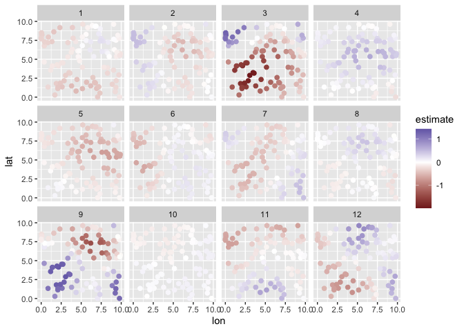
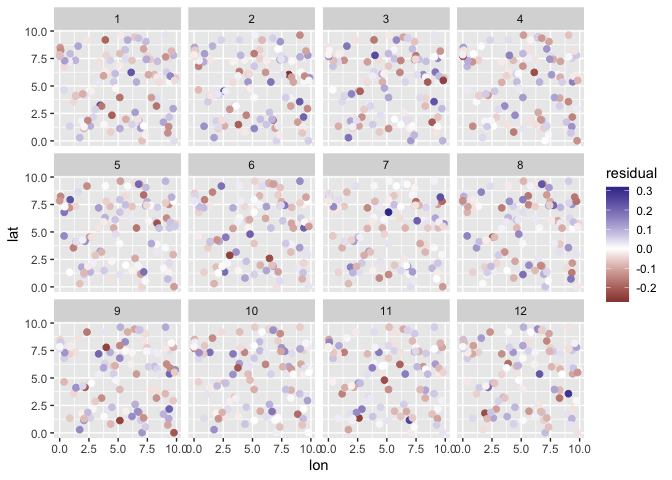
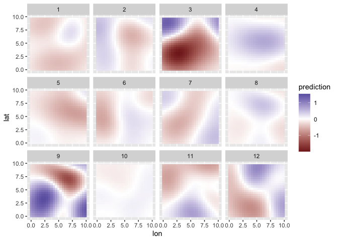

<!-- README.md is generated from README.Rmd. Please edit that file -->

# glmmfields 

[](https://github.com/seananderson/glmmfields/actions)
[](https://cran.r-project.org/package=glmmfields)
<!-- [](https://codecov.io/github/seananderson/glmmfields) -->

The glmmfields R package implements Bayesian spatiotemporal models that
allow for extreme spatial deviations through time. It uses a predictive
process approach with random fields implemented through a multivariate-t
distribution instead of a multivariate normal. The models are fit with
[Stan](http://mc-stan.org/).

We published a paper describing the model and package in *Ecology*:

Anderson, S. C., Ward, E. J. 2019. Black swans in space: modelling
spatiotemporal processes with extremes. 100(1):e02403.
<https://doi.org/10.1002/ecy.2403>

You can install the [CRAN
version](https://cran.r-project.org/package=glmmfields) of the package
with:

``` r
install.packages("glmmfields")
```

If you have a C++ compiler installed, you can install the development
version of the package with:

``` r
# install.packages("devtools")
devtools::install_github("seananderson/glmmfields", build_vignettes = TRUE)
```

glmmfields can also fit spatial GLMs with Stan. See the vignette:

``` r
vignette("spatial-glms", package = "glmmfields")
```

## An example spatiotemporal model

``` r
library(glmmfields)
#> Loading required package: Rcpp
library(ggplot2)
```

Simulate data:

``` r
set.seed(42)
s <- sim_glmmfields(
  df = 2.8, n_draws = 12, n_knots = 12, gp_theta = 2.5,
  gp_sigma = 0.2, sd_obs = 0.1
)
head(s$dat)
#>   time pt           y      lon      lat station_id
#> 1    1  1  0.02818963 9.148060 6.262453          1
#> 2    1  2 -0.21924739 9.370754 2.171577          2
#> 3    1  3 -0.34719485 2.861395 2.165673          3
#> 4    1  4 -0.15785483 8.304476 3.889450          4
#> 5    1  5 -0.04703617 6.417455 9.424557          5
#> 6    1  6 -0.23904924 5.190959 9.626080          6
```

``` r
print(s$plot)
```

<!-- -->

Fit the model:

``` r
options(mc.cores = parallel::detectCores()) # for parallel processing
m <- glmmfields(y ~ 0,
  data = s$dat, time = "time",
  lat = "lat", lon = "lon",
  nknots = 12, estimate_df = TRUE, iter = 800, seed = 1
)
```

``` r
print(m)
#> Inference for Stan model: glmmfields.
#> 4 chains, each with iter=800; warmup=400; thin=1; 
#> post-warmup draws per chain=400, total post-warmup draws=1600.
#> 
#>             mean se_mean   sd    2.5%     25%     50%     75%   97.5% n_eff Rhat
#> df[1]       3.78    0.04 1.40    2.09    2.73    3.45    4.44    7.46  1422 1.00
#> gp_sigma    0.30    0.00 0.04    0.22    0.27    0.30    0.33    0.39   441 1.01
#> gp_theta    2.59    0.00 0.06    2.46    2.55    2.59    2.63    2.71  1493 1.00
#> sigma[1]    0.10    0.00 0.00    0.09    0.10    0.10    0.10    0.10  1695 1.00
#> lp__     2291.18    0.41 9.24 2271.74 2285.06 2291.84 2297.72 2307.86   516 1.01
#> 
#> Samples were drawn using NUTS(diag_e) at Sat Jan  9 09:30:08 2021.
#> For each parameter, n_eff is a crude measure of effective sample size,
#> and Rhat is the potential scale reduction factor on split chains (at 
#> convergence, Rhat=1).
```

Plot:

``` r
plot(m, type = "prediction") + scale_color_gradient2()
```

<!-- -->

``` r
plot(m, type = "spatial-residual")
```

<!-- -->

Predictions:

``` r
# link scale:
p <- predict(m)
head(p)
#> # A tibble: 6 x 3
#>   estimate conf_low conf_high
#>      <dbl>    <dbl>     <dbl>
#> 1  -0.0292  -0.0864    0.0312
#> 2  -0.291   -0.361    -0.219 
#> 3  -0.397   -0.451    -0.344 
#> 4  -0.194   -0.271    -0.120 
#> 5  -0.0367  -0.111     0.0416
#> 6  -0.216   -0.294    -0.140

# posterior predictive intervals on new observations (include observation error):
p <- predictive_interval(m)
head(p)
#> # A tibble: 6 x 3
#>   estimate conf_low conf_high
#>      <dbl>    <dbl>     <dbl>
#> 1  -0.0292   -0.237   0.178  
#> 2  -0.291    -0.503  -0.0869 
#> 3  -0.397    -0.603  -0.195  
#> 4  -0.194    -0.401   0.0137 
#> 5  -0.0367   -0.242   0.172  
#> 6  -0.216    -0.425  -0.00916
```

Use the `tidy` method to extract parameter estimates as a data frame:

``` r
x <- tidy(m, conf.int = TRUE)
#> Registered S3 method overwritten by 'broom.mixed':
#>   method      from 
#>   tidy.gamlss broom
head(x)
#> # A tibble: 6 x 5
#>   term                     estimate std.error conf.low conf.high
#>   <chr>                       <dbl>     <dbl>    <dbl>     <dbl>
#> 1 df[1]                      3.45     1.40      2.09      7.46  
#> 2 gp_sigma                   0.299    0.0442    0.217     0.389 
#> 3 gp_theta                   2.59     0.0640    2.46      2.71  
#> 4 sigma[1]                   0.0979   0.00216   0.0941    0.102 
#> 5 spatialEffectsKnots[1,1]  -0.110    0.0355   -0.182    -0.0413
#> 6 spatialEffectsKnots[2,1]  -0.230    0.0357   -0.302    -0.163
```

Make predictions on a fine-scale spatial grid:

``` r
pred_grid <- expand.grid(
  lat = seq(min(s$dat$lat), max(s$dat$lat), length.out = 25),
  lon = seq(min(s$dat$lon), max(s$dat$lon), length.out = 25),
  time = unique(s$dat$time)
)

pred_grid$prediction <- predict(m,
  newdata = pred_grid, type = "response", iter = 100, estimate_method = "median"
)$estimate

ggplot(pred_grid, aes(lon, lat, fill = prediction)) +
  facet_wrap(~time) +
  geom_raster() +
  scale_fill_gradient2()
```

<!-- -->

# References

Anderson, S. C., Ward, E. J. 2019. Black swans in space: modelling
spatiotemporal processes with extremes. 100(1):e02403.
<https://doi.org/10.1002/ecy.2403>

Latimer, A. M., S. Banerjee, H. Sang Jr, E. S. Mosher, and J. A.
Silander Jr. 2009. Hierarchical models facilitate spatial analysis of
large data sets: a case study on invasive plant species in the
northeastern United States. Ecology Letters 12:144–154.

Shelton, A. O., J. T. Thorson, E. J. Ward, and B. E. Feist. 2014.
Spatial semiparametric models improve estimates of species abundance and
distribution. Canadian Journal of Fisheries and Aquatic Sciences
71:1655–1666.
